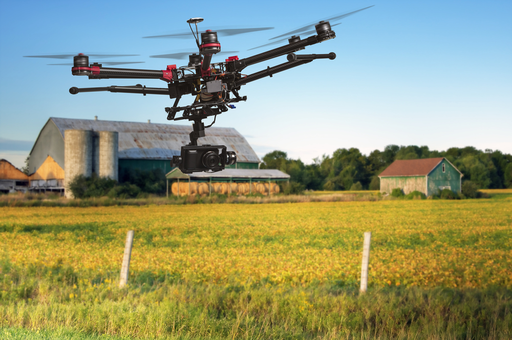

# Food x Production x Environmental Justice
 *Brian Ho    CDE Studio    2016.10.14*
Note: attempting to connect disparate subjects, wanting to feed gaps

# 1. Farms and farmers
Note: who are they, and where are they? need to seek hard data.

## The "average" farm and farmer
- **receives subsidies:** unequal distribution of $20 billion
- **getting larger:** mean 450 acres, but median at 1000 acres
- **making less:** declining ratio to prices, but 2016 average net cash farm income (NCFI) = $102,200
- **getting older:** US Labor Department says 58 years old
Note: small but important demographic

## The "forgotten" farmer

- **migrant farmworkers:** estimated 3 million, documented and undocumented
- **compounding social impacts:** itinerant population, socioeconomic underserved
Note: statistics misleading

## The missing middle farm

  
 **COMMODITY**

  
 **THE MIDDLE?**

  
 **DIRECT**

Note: statistics misleading

## History
- **pre-20th century:** low prices spur populist protest movements: the Grange, Farm Alliance or National Farmers Union
- **FDR + the New Deal:** Agriculture Marketing Act of 1929, Agricultural Adjustment Act of 1933
- **post-WWII:** USDA focus on industrialization via Ezra Benson
- **"get big or get out":** Earl Butz, and a shift to a globalized food economy
- **oil crisis and the modern era:** increasing production, declining prices
Note: "The Agriculture Marketing Act, which established the Federal Farm Board in 1929. AAA reduced agricultural production by paying farmers subsidies not to plant on part of their land and to kill off excess livestock. Its purpose was to reduce crop surplus and therefore effectively raise the value of crops." Larger societal shifts.

# 2. Agribusiness
Note: Segue into industrialization.

## Farm as industry
- **larger farms, fewer crops:** shrinking political capital
- **fewer farmers:** 21 million workers, about 2% of total population
- **vertical integration:** farmers purchase equipment and supplies from their product buyers
- **extended commodity supply chain:** limited direct access to markets for farmers

## Bowman v. Monsanto Co. - 2013

- **patent exhaustion doctrine:** taken to US Supreme Court
- **saving seeds:** ruled illegal if any "contamination" of genetic IP

## The question of technology + ownership
- **John Deere:** tractors, software, etc - leases jumped to $2.78 billion
- **right to repair:** 2014 comments to US Copyright Office around 1998 DMCA

# 3. Technology
Note: future of farming

## "Precision" farming

Obligatory drone picture.

## John Deere Precision Ag
<iframe src="https://www.youtube.com/embed/jEh5-zZ9jUg" frameborder="0" width="1280" height="720" frameborder="0" webkitallowfullscreen mozallowfullscreen allowfullscreen></iframe>

## Reimer Robotics
<iframe src="https://www.youtube.com/embed/mYEHvuDq2Fs" frameborder="0" width="1280" height="720" frameborder="0" webkitallowfullscreen mozallowfullscreen allowfullscreen></iframe>

# 4. Possible questions + directions

<h3 class="fragment">How might we challenge ownership and creation of technology?</h3 class="fragment">
<h3 class="fragment">How might we empower mid-scale farms and farmers?</h3 class="fragment">
<h3 class="fragment">How might we reconsider a growing rural-urban divide?</h3 class="fragment">
