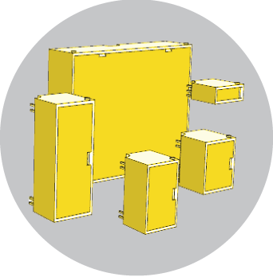
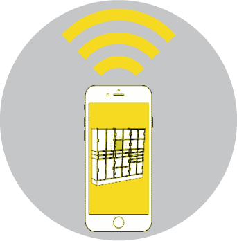
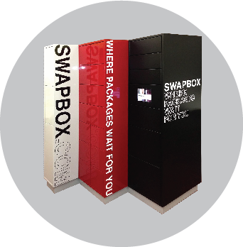
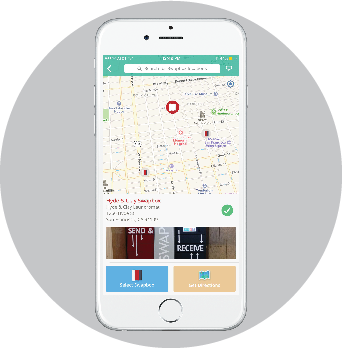
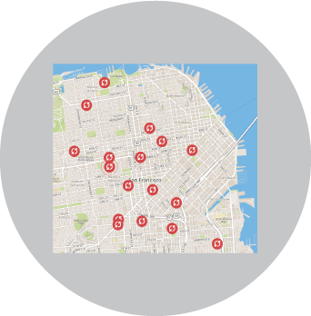
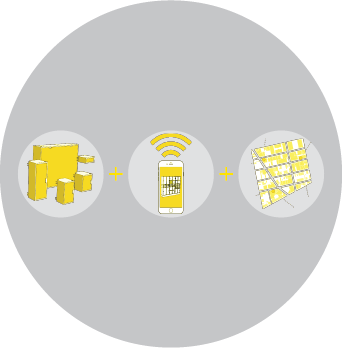
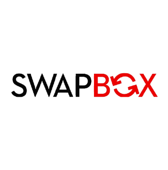
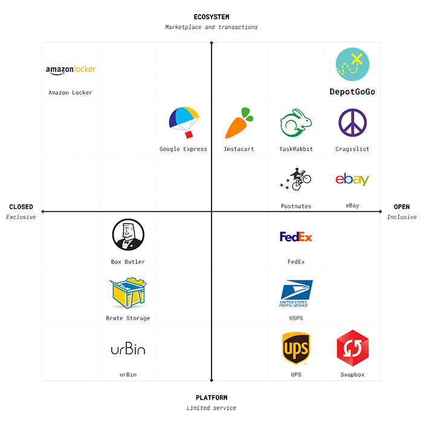
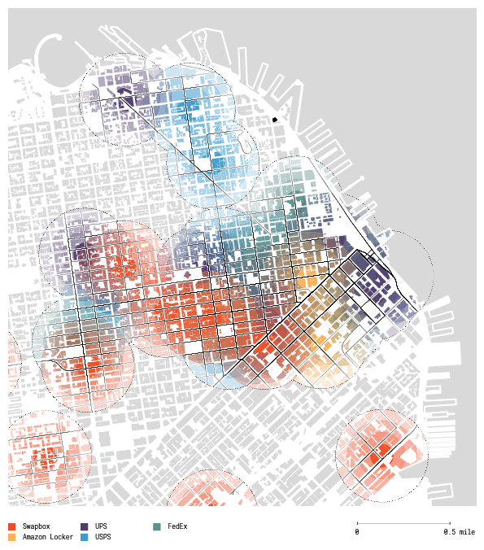

# Food + Environmental Justice
 *Brian Ho    CDE Studio    2016.10.14*
Note: frame this as a  presentation of a business concept design, based on existing business plan. Less quantitative, more qualitative and experiential?

# 1. Farms
Note: researched existing business model

## Concept Overview
As defined in the existing business plan, DepotGoGo is based around a few key ideas:
- **Digital to physical:** based around the idea of returning "clicks to bricks."
- **Delivery alternative:** makes distributed modular storage available for sending, receiving and storing.
- **Sharing economy:** enables seamless and simple distribution of goods.
Note: instead of delivering to office (receptionist) or home (waiting), a secure and convenient way to do it on your way there.

## Proposed Network
DepotGoGo is a system that provides digitally-enabled, flexible storage and an exchange of goods and products

  
 **STORAGE**

  

  
 **APP**

  

  
 **INFRASTRUCTURE**

Note: As understood in business plan: three elements are key to network. But a bunch of boxes in convenient locations. What do they do?

## Value

  

  <h3 style="text-align: center">To Consumers</h3>
  
**Digital Commerce:** fulfillment of online marketplaces / alternatives to home delivery / grocery delivery

  

  
**Exchange of Product:** secure, confirmable transactions / convenient localized installation

  

  
**Physical Storage:** moving and transitional storage / recreation and athletic gear / dropboxes for the mobile workforce

  

  

  <h3 style="text-align: center">To Partners</h3>
  
**Foot Traffic:** activates underutilized space for owners, operators, and occupants of residential and commercial real estate

  

  

  <h3 style="text-align: center">To DepotGoGo</h3>
  
**Convenience as Service:** Monetizes time and cost savings for sellers, service providers, and users.

  

Note: Why would you use it? Consumers can simplify the process of receiving and returning packages, exchanging goods with friends or storing personal items on the go. Use cases.

We felt we needed to prototype the concept!

# 2. Assessment

## Validation
To validate the feasibility and desirability of the concept, we investigated an incumbent service in this market: Swapbox.
Note: Swapbox as a ready-made high-fidelity prototype that replicates some but not all of proposed DepotGoGo functionalities.

## Swapbox Primer
<iframe src="https://player.vimeo.com/video/97379917" width="1280" height="720" frameborder="0" webkitallowfullscreen mozallowfullscreen allowfullscreen></iframe>

[Swapbox](http://www.swapbox.com) is an automated 24/7 post office that enables easy sending and receiving of packages.

## Swapbox Network
Swapbox uses modular lockers and digital platform to create an urban infrastructure.

  
 **STORAGE**

  

  
 **APP**

  

  
 **INFRASTRUCTURE**

## Research Methodology
Swapbox served as a high fidelity prototype for elements of the DepotGoGo concept. We conducted:

- **Survey:** questionnaire for potential consumers
- **Site visits:** locations in North Beach, Nob Hill and Downtown
- **Interviews:** with owners of partner location

Note: We interviewed both business owners and people on-site at the location. We did not observe any users.

## Findings

  

  <h3 style="text-align: center">Positives</h3>
  
**Hardware:** well designed: modular, modern finish, visible presence

  

  
**Software:** integrated well onto hardware, simple interface, leverages presence to educate

  

  

  <h3 style="text-align: center">Areas of Opportunity</h3>
  
**Location:** laundromats and liquor stores (excluding Safeway partnerships)

  
**Logistics:** pack and ship ($1.99 per package, $7.99 monthly for 10 deliveries, $14.99 monthly for unlimited deliveries)

  

  

  <h3 style="text-align: center">System Challenges</h3>
  
**Vendor value proposition:** foot traffic is not converting into sales; rent to place Swapbox is not sufficient

  
**Behavioral barrier:** "I'll just use my office's receptionist / mailroom"

  

Swapbox seems to be at a standstill since its 2013 debut.

No social media or public visibility since July-December 2015

Note: Good- hardware, software; Could be improved- location, logistics, foot traffic not converting to sales. Cultural/mental barrier. Creating the appropriate environment for usage is . Anecdotally used 4-5 times a day; others locations never used.

# 3. Strategy
Note: A few areas to exploit and challenges to overcome. System challenges key. Barriers to success: the environment / location mental + cultural norms. People don't want to use it (ref. Swapbox video).

DepotGoGo currently exists as a platform.
We need to supplement that platform with an **_ecosystem_** to overcome barriers to usage.

## The DepotGoGo Platform
A physical and digital network.

  
 **STORAGE**

  

  
 **APP**

  

  
 **INFRASTRUCTURE**

## The DepotGoGo Ecosystem
A network and the transactions that populate it.

  
 **BUYER**

  

  
 **PLATFORM**

  

  
 **SELLER**

## Ecosystem

Allows DepotGoGo to from simply replacing existing services:

- **Receptionist:** no more sending items to the office
- **Post offices:** picking up / dropping off / storage of items

... to facilitating its own usage via the creation of an exchange marketplace that introduces delight and discovery.

- **Security:** a trusted network
- **Privacy:** a convenient and secure exchange of goods
- **Simplicity:** an uncomplicated, user-friendly interface

Note: gets over barrier, it's more than a receptionist replacement, or delivery alternative. Also might be opportunities for delight.

## Ecosystem Concept

DepotGoGo can build on successful elements of existing services, in both related and unrelated spaces.

  

 **LOGISTICS**

  

  

 **TRANSACTIONS**

  

  

 **EXPLORATION**

Note: simple AND fun!

# 4. Planning and Design

## Competitive Positioning

DepotGoGo as an ecosystem occupies a competitive niche ...

<!--

  
 **LOGISTICS**

  
 **LOGISTICS**

  
 **LOGISTICS**

  
 **LOGISTICS**

  
 **LOGISTICS**

  
 **LOGISTICS**

  
 **LOGISTICS**

  
 **LOGISTICS**

  
 **LOGISTICS**

  
 **LOGISTICS**

  
 **LOGISTICS**

  
 **LOGISTICS**

  
 **LOGISTICS**

  
 **LOGISTICS**

  
 **LOGISTICS**

  
 **LOGISTICS**

  
 **LOGISTICS**

  
 **LOGISTICS**

 -->
Note: Closed is amazon locker. Open is DGG. Ecosystem means complete series of infrastructures (vertical). Compare to a few: CL, postmates, Swapbox, Amazon Locker.

## Physical Positioning

... which enables DepotGoGo to enter a literally crowded space with a competitive advantage that defines new territory.

## Further Considerations

A DepotGoGo network's physical positioning could also be optimized for:

- **Walkability:** urban areas, low car ownership
- **Population density:** small catchment areas must attract enough customers
- **"Medium" income:** willing to pay for service and unwilling to buy new
- **High occupant turnover:** more people selling/buying items
- **Young adult demographic:** more likely to seek bargains and more transient
- **Coffeeshops:** social locations incentivize use

Note: Perhaps College campuses-where should we pilot?, high concentration of young adult occupants in homes... evenntually to knowing customer preferences by location.

# 5. Implementation

 Live prototype available online at [bit.ly/depotgogo](http://adobe.ly/2amz1vx).

# Fin
